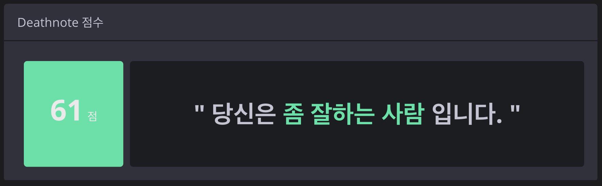
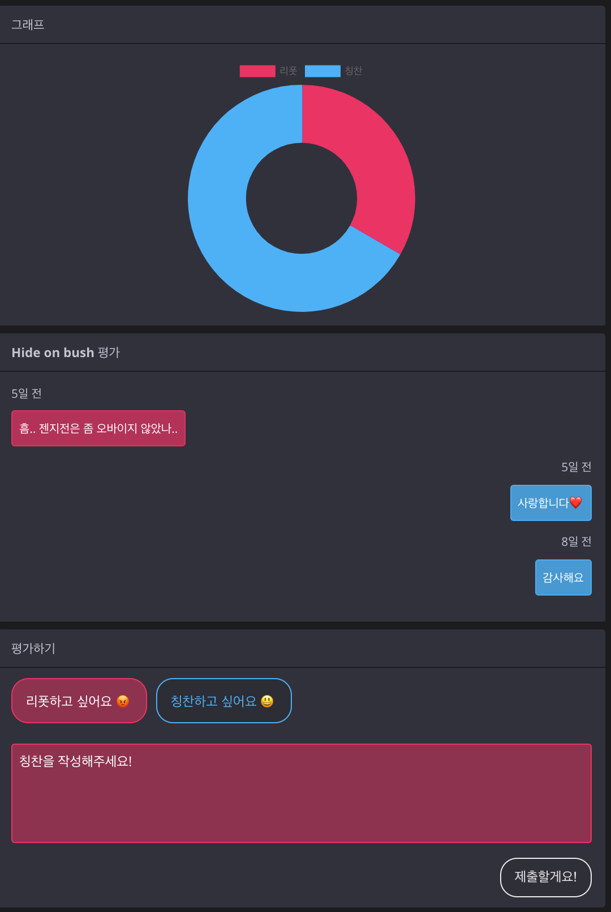
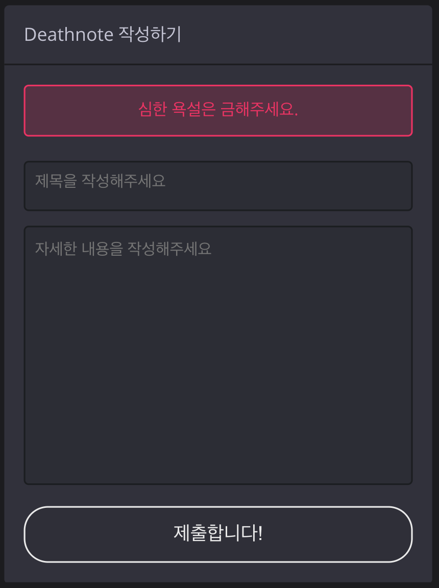
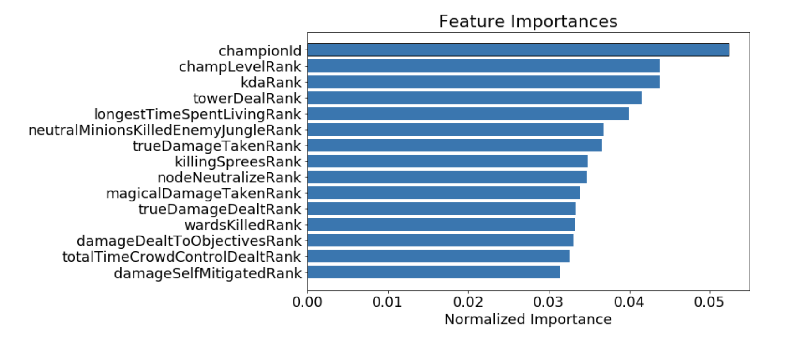

# deathnote-api-server

<h3>

💻 deathnote.gg ver2.0 API 서버

</h3>

<h4>

리그 오브 레전드의 사용자 Report 기능의 문제를 해결하고자 합니다.

</h4> 

## 💁‍♂️ Links

### 1. deathnote.gg

https://deathnote.gg/

### 2. Faker 선수 정보

https://deathnote.gg/summoner/name=hide%20on%20bush

### 3. deathnote ML Code ( Kaggle )

https://www.kaggle.com/ryoopatrick/deathnote-gg-get-feature-importance

### 4. Swagger UI

https://www.kaggle.com/ryoopatrick/deathnote-gg-get-feature-importance

 

 

## 😢 Problem

리그 오브 레전드에는 고질적으로 사용자 Report 시스템의 불완전성의 문제가 
존재해왔습니다.

여기서 Report 시스템이란, 사용자를 신고하는 기능을 의미합니다. 
리그 오브 레전드는 한 게임 평균 시간이 20~30분입니다.  

트롤(게임을 망치는 유저)는 같은 팀인 나머지 4명 뿐아니라, 상대 팀 5명에게까지 게임의
재미를 떨어지게 만들기 때문에, 트롤 한 명이 가져오는 시간적 손실은 대략 200~300분에 달할 수 있습니다.  

Report 시스템의 문제는 개발사인 Riot과 프로게이머들 또한 지적해온 문제입니다. 
Deathnote.gg 서비스에서는 이런 문제를 해결하기 위해서 노력하는 서비스입니다.

  

## ⭐️ Feature

### 1. 소환사 정보 조회 기능

 

<h4>

소환자 정보 뷰 ( Faker 선수 )

</h4> 

### Solution

유저가 게임에 미치는 영향을 100점 만점으로 환산하여 직관적으로 정보를 제공합니다.
 

<h4>

결과값 예시 화면

</h4> 

1. Riot API로부터 Match Data들을 수집한다.
   **Summoner API - Get EncryptedSummonerID**  **MatchList API - Get MatchListID** **Match API - Get MatchInfo** 

   Riot API에게 여러 번의 요청을 연쇄적으로 진행해야 합니다.
   각각의 요청 단계에서 이전 단계의 데이터들이 필요하기 때문입니다.

2. 데이터들을 전처리합니다.
   각 지표들 (ex. Kills, Deaths, TowerKills .. )을 총 10명의 플레이어들 중에서 몇 등을 기록했는지 정리합니다.
   이 과정이 필요한 이유는 매게임마다 플레이어가 트롤인지 아닌지는 **상대적**이기 때문입니다.

3. 여러 지표들에 가중치를 다양하게 매겨봅니다.

4. 실제 유저들의 최근 20게임의 데이터를 통해 가중치가 제대로 매겨졌는지 확인합니다.

5. Troller Score 로직을 구체화합니다.

  

### 2. 특정 유저에게 리뷰 작성 기능

 

<h4>

그래프 및 작성 뷰

</h4> 

 

### Solution

Report를 작성 가능합니다. Report에는 칭찬과 리폿 두 가지 중에 선택을 하여 진행할 수 있습니다. 이는 데스노트 점수에 반영됩니다. 

이 기능은 사용자의 수에 비례하여 기능의 유용성이 높아집니다. 
트롤러 점수 기능은 사용자 수를 증가시키기 위해서 추가하려 하는 기능입니다.

1. 서버단에서, CRUD 기능을 구현합니다.

2. 브라우저 캐시를 통해서 사용자는 자신이 Report한 부분에 대해서 U,D 기능이 가능하게 합니다.

3. 유의미한 데이터가 쌓였을 때부터 실제 트롤러 점수 연산 알고리즘에 해당 지표를 추가합니다.

4. 서버 단에서, Report 내용에 부적절한 말이 들어갔는지, 혹은 어뷰징이 있는지를 체크합니다.

     
  

### 3. 최근 20게임 분석

 

<h4>

현재 리뉴얼 작업 중 ( 여러 지표가 추가될 예정 )

</h4> 

 

### Solution

이 기능 또한, 결국은 Report 시스템의 사용성을 증가시키기 위한 과정입니다.
보통의 전적 검색 사이트의 경우 모든 전적 그리고, 함께 플레이한 다른 유저의 정보까지 모두
가져오지만, 데스노트 서비스의 경우는 각 게임 당의 여러 지표의 순위 정보를 제공하려 합니다.
( 이는, 실제로 트롤러 점수 연산시 사용하기 때문에, 제공하는 것이 어렵지 않습니다. 

*현재 디자인 리뉴얼 작업 중에 있어, 보여지지는 않고 있습니다.*

 

1. DB를 조회했을 때, 이전 정보가 존재하지 않으면 Riot API에 재요청합니다.
2. 데이터를 받아온 이후에, 각 지표별 Rank를 Return 하는 함수를 이용합니다.
3. Client에 Response 합니다.

  

### 4. 데스노트 랭킹 확인 기능

 

<h4>

랭킹 뷰 UI

</h4> 

 

### Solution

이 기능은 서비스에 재미 요소를 위해서 추가한 기능으로, 점수가 낮을수록 트롤러라고 판단할 수 있기 때문에, 오름차순으로 순위를 정렬하여 보여줍니다.

 
 

### 5. 데스노트 신고 기능 

 

<h4>

신고 작성 기능

</h4> 

 

### Solution

해당 기능은, 소환사에 대한 리뷰를 넘어 신고할 수 있는 기능입니다.  

신고가 누적된 소환사에 대해서는 소환사 정보 조회 페이지에 따로 표시를 하는 등의 기능을 추가할 예정입니다.

 
 

## 🧐 Difficulty

### 1. Riot API 요청에 제한이 있다.

Riot측에서 어느 정도의 Public함을 증명하기 전까지는 API의 요청을 제한하고, 단계적으로 제한을 풀어줍니다. 이에 따라, 요청을 최소화하기 위해서 요청한 데이터에 관해서 자체 DB에 저장해놓는 작업이 필요합니다. 그리고, 사용자가 전적 업데이트를 진행하면 다시 Riot API에 정보를 새롭게 요청합니다. 
이 때, 재요청할 때는 몇몇 중요 정보를 DB에 저장해놓기 때문에 여러 API를 연쇄적으로 요청하지 않아 API 요청 횟수를 줄일 수 있습니다.  

뿐만 아니라, **Ehcache**를 적용하여 공통된 요청이 많은 경우에는 API 요청을 하지 않도록 진행하였습니다.

  

### 2. API 응답 속도가 너무 느리다.

결과를 도출해내는데 까지, Riot API를 더불어 자체적으로 구현한 로직들까지 수행해야 하기에 응답 시간이 10초 이상이 소요되는 문제가 있었습니다. 

가장 응답 시간이 오래 걸리는 부분은 Riot API에서 요청하는 Match API 였는데, 이는 정보를 업데이트 할 때, 10번~20번 정도씩 요청을 해야하기 때문이었습니다. 

이를 해결하기 위해서는 멀티 스레드 기능을 활용하였습니다.  

결과적으로는 10초대에서 2초대로 연산 시간을 줄일 수 있었습니다.

  

### 3. 트롤러 점수 연산 알고리즘 자체 구현

트롤러 점수가 유의미하기 위해서는 사용자가 신뢰할 수 있는 기준을 가지고 연산을 진행하고, 이런 과정을 서비스 내에서 사용자들이 열람 가능하게끔 해주어야 한다고 판단이 들었습니다. 

따라서 임의로 기준을 정하는 것이 아니라, 가중치를 구하는 작업을 진행해야 했습니다. 

해당 작업은 이렇게 진행했습니다.

1. 데이터를 RIOT API에 일정 시간 간격을 두고 요청하여 수집합니다. 
2. 수집한 데이터를 10명 중에 몇 등의 지표인지를 알아내기 위해서 Rank를 구하는 함수에 넣어줍니다. ( 16000 개의 데이터를 사용했습니다. )
3. 수집한 데이터를 CSV 파일로 Export 합니다. ( OpenCSV 사용 ) 
4. Lightgbm 모델을 사용하여 Feature 들의 Importance를 추출합니다.
5. 알고리즘에 해당 지표들을 반영합니다. ( **반영 완료** )

<h4>

실제 결과 화면 뷰 

</h4> 

#### **소스 코드 확인하기**

https://www.kaggle.com/ryoopatrick/deathnote-gg-get-feature-importance

  

## 🔨 Dev stack

- Spring Boot
- Spring MVC
- Spring JPA
- AWS EC2
- AWS RDS

  

## Swagger

 

<h4>

 

#### **Swagger 링크**

https://donghoon.site/swagger-ui.html

 

## Commit Convention

- **feat**: A new feature
- **fix**: A bug fix
- **docs**: Changes to documentation
- **style**: Formatting, missing semi colons, etc; no code change
- **refactor**: Refactoring production code
- **test**: Adding tests, refactoring test; no production code change
- **chore**: Updating build tasks, package manager configs, etc; no production code change

## Reference

- **Commit Convention** 
  https://udacity.github.io/git-styleguide/

- Riot API 
  https://developer.riotgames.com/
