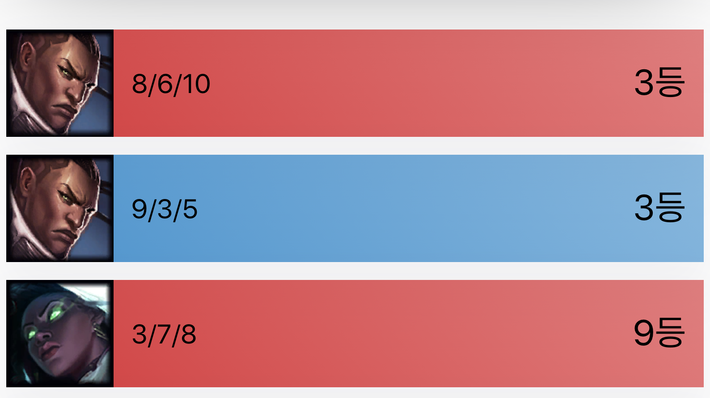
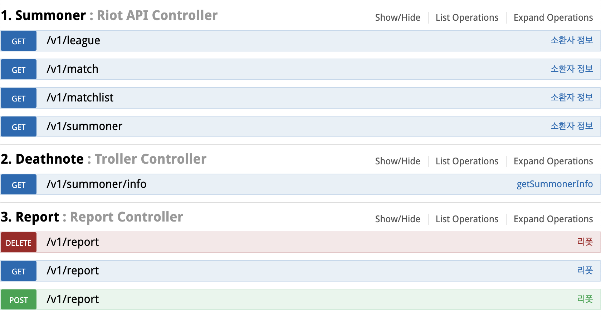

# deathnote-api-server
deathnote.gg ver2.0 API 서버

## Application screenshots

## Problem
리그 오브 레전드의 사용자 Report 시스템의 불완전성의 문제
- 트롤(게임을 망치는 유저)을 신고하더라도, 제대로 반영되지 않음.
- 해당 유저가 트롤인지 전적 검색만으로는 쉽게 알기 힘듦 ( https://op.gg 참고 )

## Solve
1. Riot API로부터 Match Data들을 수집한다.
Summoner API - Get EncryptedSummonerID 
MatchList API - Get MatchListID
Match API - Get MatchInfo
2. 데이터들을 전처리합니다.
각 지표들 (ex. Kills, Deaths, TowerKills .. )을 총 10명의 플레이어들 중에서 몇 등을 기록했는지 정리합니다.
이 과정이 필요한 이유는 매게임마다 플레이어가 트롤인지 아닌지는 상대적이기 때문입니다.
3. 여러 지표들에 가중치를 다양하게 매겨봅니다.
4. 실제 유저들의 최근 20게임의 데이터를 통해 가중치가 제대로 매겨졌는지 확인합니다.
5. Troller Score 로직을 구체화합니다.

## Feature
### Troller 점수 확인 기능
100점 만점으로 환산한 결과값을 사용자에게 보여줍니다.

### 특정 유저에게 리뷰 작성 기능
작성된 리뷰는 트롤러 점수 환산 시에 반영됩니다.

### 최근 20게임 분석
매 게임마다의 자신이 트롤 등수를 확인합니다.

## Swagger 정리

## Contact
dong149 - donghoon149@gmail.com
Project Link: 준비중입니다.
